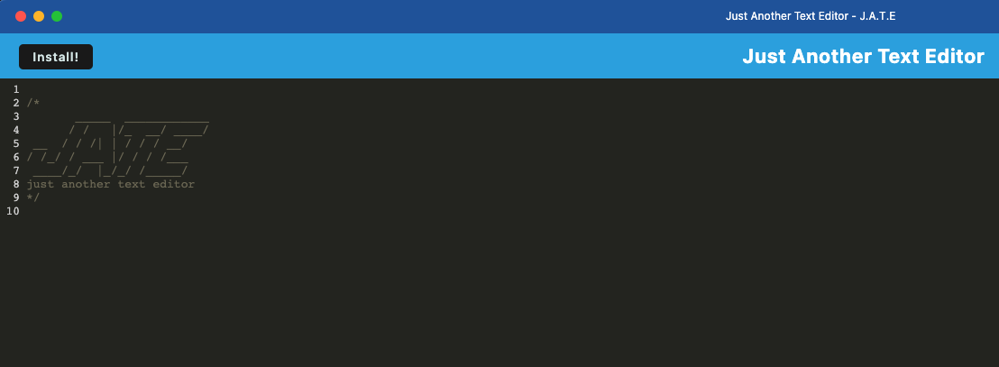

# PWA-Text-Editor
Walkthrough of a given code with a focus on the PWA, Progressive Web App, that is included with the build.

  ## Description:
  This code was given to me and I was asked to create a video walkthrough describing what the code is doing. None of the code on the app itself was written by me, there were slight adjustments made to the root package.json file, but the installation notes below explain how to run the app. 

  ## Table of Contents:
  - [Installation](#installation)
  - [Usage](#usage)
  - [License](#license)
  - [Contributions](#contributions)
  - [Walkthrough Video](#link-to-google-drive-video)
  - [Repo](#repo)

 ## Installation
 Once you have the repo cloned on your machine you will need to assure you are in the root directory, then in the terminal run the following commands. 

 `npm run install`

 *Make sure to write out install. DON'T do `npm i`*

 Once the dependecies have all been installed run:

 `npm run build` 

 This will run your webpack plugin and create your 'dist' folder. 
 Once that's done run:

 `npm run dev`

 Now the app will be running on the port: 3003.

 ## Usage 
   JATE is Just Another Text Editor. It's a fairly simple text editor with a PWA attached that allows the user to install the app and continue to use it while offline. 

 ## License 
  N/A

 ## Contributions 
  N/A

 ## Screen Shot
 

# LINKS

 ## Link to Google Drive Video 
https://drive.google.com/file/d/1suzKJqjT9iZUfdmthPdnhdRYh3qn5OWV/view?usp=sharing

 ## Repo 
 https://github.com/Zcordeiro/PWA-Text-Editor

